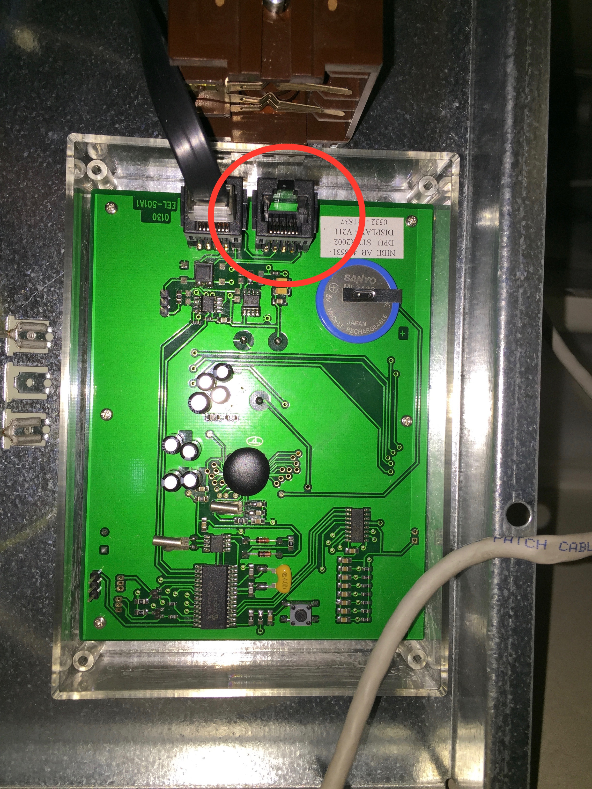

# nibe-data-dump Readme

Arduino board for dumping data over Wifi from a Nibe Geothermal Heat Pump (Fighter Series).

### Current functionality: 

* Data collection over RS485 serial bus
* Dumping the traffic on the internal Nibe Data Bus to an Arduino board via a serial RS485 shield 
* Posting of data to any HTTP REST service over Wifi using an ESPN8266 Wifi shield
    
### Requirements:

 - Arduino ATmega2560 (or any Arduino compatible board with support for two or more programmable serial ports).
 - ESP2866 Wifi shield for Arduino
 - WifiEsp Software library for ESP8266 - https://github.com/bportaluri/WiFiEsp
 - RS485 shield for Arduino
 - Install the Arduino Sketch - https://github.com/matsjo/nibe-analytics/blob/master/nibe-data-dump/nibe-data-dump.ino 
 
 - A webservice collecting the Nibe data messages (logstash, AWS Lamdba, Node.js, Tomcat etc, etc, etc) and writing them to cloud storage. Example provid at https://github.com/matsjo/nibe-analytics/tree/master/logstash 

### Arduino Board

 ** WARNING ! Before connecting the Arduino, the Nibe heat pump and the Arduino logger MUST have a common ground connected. Otherwise the Nibe CPU PCB is in danger (expensive).  

 
 #### (Pict 1) Arduino circuit schema

### Connection schema Nibe RJ45 -> TP Cable -> RS485 -> Arduino 

 The connection to the heat pump is done using a standard RJ-45 TP Ethernet cable (for pinning se table below). Connect the cable to any of the Nibe Serial Bus end-points. For Nibe 1130 thee are two serial bus end-points at the Display Unit (DPU) and at the main PCB (pictures below).  
 
| Nibe RJ45 | RS485 | Arduino |
|-----------|-------|---------|
|   1  |   A   |         |
|   2  |   B   |         |
|  7,8 |       |   GND   |
|      |   DI  |   18    |
|      |   DE  |    9    |
|      |   RE  |    8    |
|      |   RO  |   19    |
|      |   GND |   GND   |
|      |   VCC |   5V    |

 
 
#### (Pict 2) Arduino RS485 close-up

### Connecting the Arduino

We can connect the Arduino to the the RJ245 connector at the Nibe DPU board OR to the Main Nibe PCB.

 

##### (Pict 3) Nibe DPU RJ-45 connector location

 
##### (Pict 4) Nibe PCB RJ-45 connector location

 

 
